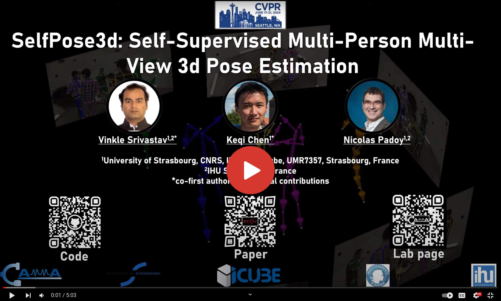

<div align="center">
<a href="http://camma.u-strasbg.fr/">

</a>
</div>

## **SelfPose3d: Self-Supervised Multi-Person Multi-View 3d Pose Estimation**
Vinkle Srivastav*, Keqi Chen*, Nicolas Padoy, CVPR 2024

*equal contribution

[](https://arxiv.org/abs/2404.02041)

## Introduction

<div style="text-align: justify"> 
We present a new self-supervised approach, SelfPose3d, for estimating 3d poses of multiple persons from multiple camera views. Unlike current state-of-the-art fully-supervised methods, our approach does not require any 2d or 3d ground-truth poses and uses only the multi-view input images from a calibrated camera setup and 2d pseudo poses generated from an off-the-shelf 2d human pose estimator. We propose two self-supervised learning objectives: self-supervised person localization in 3d space and self-supervised 3d pose estimation. We achieve self-supervised 3d person localization by training the model on synthetically generated 3d points, serving as 3d person root positions, and on the projected root-heatmaps in all the views. We then model the 3d poses of all the localized persons with a bottleneck representation, map them onto all views obtaining 2d joints, and render them using 2d Gaussian heatmaps in an end-to-end differentiable manner. Afterwards, we use the corresponding 2d joints and heatmaps from the pseudo 2d poses for learning. To alleviate the intrinsic inaccuracy of the pseudo labels, we propose an adaptive supervision attention mechanism to guide the self-supervision. Our experiments and analysis on three public benchmark datasets, including Panoptic, Shelf, and Campus, show the effectiveness of our approach, which is comparable to fully-supervised methods.
</div>

### SelfPose3d 5 minute introduction video

[](http://www.youtube.com/watch?v=GAqhmUIr2E8 "SelfPose3d")


### SelfPose3d overall framework


### Demo outputs
Sample output of __*SelfPose3d*__ showing the inference on the CMU panoptic dataset video. 
<p float="center">  </p>


#### In this repo we provide:
- Training and testing code for SelfPose3d, a state-of-the-art self-supervised multi-view multi-person 3d pose estimation method. 
- Trained model on the CMU Panoptic dataset. 

## Installation
1. Clone this repo, and we'll call the directory that you cloned as ${POSE_ROOT}.
2. Install dependencies. 
```shell
> conda create -n selfpose3d python=3.9
> conda activate selfpose3d
(selfpose3d)> conda install pytorch==1.13.1 torchvision==0.14.1 pytorch-cuda=11.7 -c pytorch -c nvidia
(selfpose3d)> pip install -r requirements.txt
```

## Data preparation

### CMU Panoptic dataset
1. Download the dataset by following the instructions in [panoptic-toolbox](https://github.com/CMU-Perceptual-Computing-Lab/panoptic-toolbox) and extract them under `${POSE_ROOT}/data/panoptic_toolbox/data`.
- The sequences that we used are as follows:
```
|-- Train
|   |-- 160422_ultimatum1
|   |-- 160224_haggling1
|   |-- 160226_haggling1
|   |-- 161202_haggling1
|   |-- 160906_ian1
|   |-- 160906_ian2
|   |-- 160906_ian3
|   |-- 160906_band1
|   |-- 160906_band2
|-- Test
|   |-- 160906_pizza1
|   |-- 160422_haggling1
|   |-- 160906_ian5
|   |-- 160906_band4
```
- You can only download those sequences you need. You can also just download a subset of camera views by specifying the number of views (HD_Video_Number) and changing the camera order in `./scripts/getData.sh`. The sequences and camera views used in our project can be obtained from our paper.
- Note that we only use HD videos,  calibration data, and 3D Body Keypoint in the codes. You can comment out other irrelevant codes such as downloading 3D Face data in `./scripts/getData.sh`.
- To extract the images after downloading the videos, you can use `./scripts/hdImgsExtractor.sh`.
2. Download the pretrained backbone model from [trained models and pseudo labels](https://github.com/CAMMA-public/SelfPose3d?tab=readme-ov-file#trained-models-and-pseudo-labels) and place it here: `${POSE_ROOT}/models/pose_resnet_50_384x288.pth`. 
3. Download the pseudo 2d labels of CMU Panoptic dataset from [trained models and pseudo labels](https://github.com/CAMMA-public/SelfPose3d?tab=readme-ov-file#trained-models-and-pseudo-labels) and place them under: `${POSE_ROOT}/data/panoptic_toolbox/data`. 

### Trained models and pseudo labels
Download the trained models and the pseudo 2d labels as follows. You can also follow [pseudo_2d_labels_generation](./pseudo_2d_labels_generation/README.md) to generate the pseudo 2d labels. 

```shell
> wget https://s3.unistra.fr/camma_public/github/selfpose3d/selfpose3d_models_pseudo_labels.zip
```


The directory tree should look like this:
```
${POSE_ROOT}
|-- models
|   |-- pose_resnet_50_384x288.pth
|   |-- cam5_rootnet_epoch2.pth.tar
|   |-- cam5_posenet.pth.tar
|   |-- backbone_epoch20.pth.tar
|-- data
    |-- panoptic-toolbox
        |-- data
            |-- 160224_haggling1
            |   |-- hdImgs
            |   |-- hdvideos
            |   |-- hdPose3d_stage1_coco19
            |   |-- calibration_160224_haggling1.json
            |-- 160226_haggling1
            |-- ...
            |-- group_train_cam5_pseudo_hrnet_soft_9videos.pkl
            |-- group_train_cam5_pseudo_hrnet_hard_9videos.pkl
            |-- group_validation_cam5_sub.pkl
```

## Training
### CMU Panoptic dataset

Train and validate on the five selected camera views. You can specify the GPU devices, batch size per GPU and model path in the config file. We trained our models on two GPUs. 

#### 1. Backbone training
```
python -u tools/train_3d.py --cfg configs/panoptic_ssl/resnet50/backbone_pseudo_hrnet_soft_9videos.yaml
```

#### 2. Root Net training
```
python -u tools/train_3d.py --cfg configs/panoptic_ssl/resnet50/cam5_rootnet.yaml
```

#### 3. Pose Net training
```
python -u tools/train_3d.py --cfg configs/panoptic_ssl/resnet50/cam5_posenet.yaml
```

#### 4. (Optional) Pose Net fine-tuning on high-confidence data
```
python -u tools/train_3d.py --cfg configs/panoptic_ssl/resnet50/cam5_posenet_finetune.yaml
```

## Evaluation
### CMU Panoptic dataset
```
python -u tools/evaluate.py --cfg configs/panoptic_ssl/resnet50/cam5_posenet.yaml --with-ssv --test-file models/cam5_posenet.pth.tar
```


## Citation
If you use our code or models in your research, please cite with:
```bibtex
@InProceedings{Srivastav_2024_CVPR,
    author    = {Srivastav, Vinkle and Chen, Keqi and Padoy, Nicolas},
    title     = {SelfPose3d: Self-Supervised Multi-Person Multi-View 3d Pose Estimation},
    booktitle = {Proceedings of the IEEE/CVF Conference on Computer Vision and Pattern Recognition (CVPR)},
    month     = {June},
    year      = {2024},
    pages     = {2502-2512}
}
```

### References
The project uses [voxelpose-pytorch](https://github.com/microsoft/voxelpose-pytorch). We thank the authors of voxelpose for releasing the code. If you use voxelpose, consider citing it using the following BibTeX entry.
```bibtex
@inproceedings{voxelpose,
    author={Tu, Hanyue and Wang, Chunyu and Zeng, Wenjun},
    title={VoxelPose: Towards Multi-Camera 3D Human Pose Estimation in Wild Environment},
    booktitle = {European Conference on Computer Vision (ECCV)},
    year = {2020}
}
```

The project also leverages following research works. We thank the authors for releasing their codes.
- [Rand-Augment and Rand-Cut](https://github.com/jizongFox/pytorch-randaugment)

## License
This code and models are available for non-commercial scientific research purposes as defined in the [CC BY-NC-SA 4.0](https://creativecommons.org/licenses/by-nc-sa/4.0/). By downloading and using this code you agree to the terms in the [LICENSE](LICENSE). Third-party codes are subject to their respective licenses.
